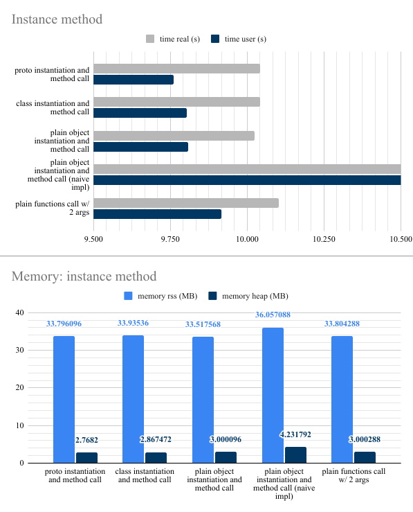
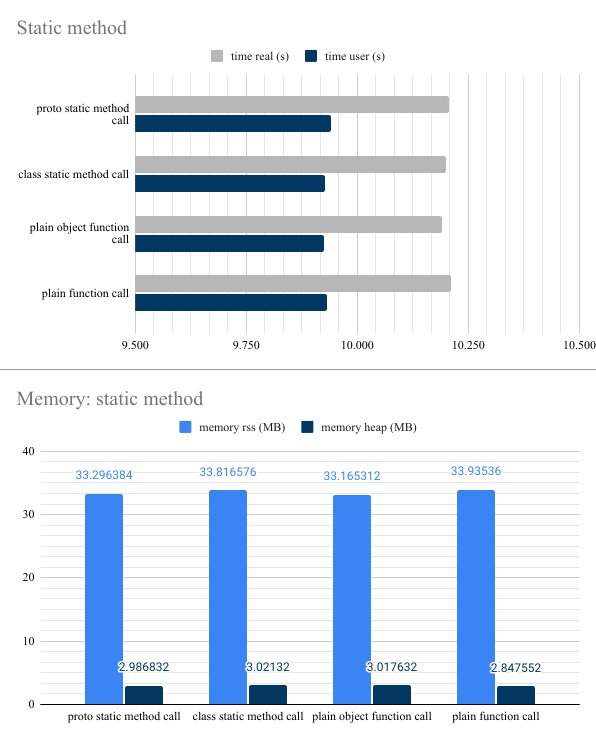

# NodeJS classes benchmark

A simple (and non scientific) benchmark that aims to compare the speed and memory usage of `prototype`, `classes`, `plain objects` and `plain functions` on object instances (methods) and statically (static methods / plain functions).

## Results

**Specs:**
- OS: Ubuntu 20.04.2 LTS x86_64
- CPU: Intel i7-10510U (8) @ 4.900GHz
- Memory: 15747MiB
- NodeJS: v14.8.0

> ℹ️ You results may differ



---------------



```
$ ./run.sh 
nodejs version: v14.8.0

# INSTANCE METHOD #######################

## proto instantiation and method call --------------------

real    0m10,041s
user    0m9,761s
sys     0m0,478s

Memory usage:
rss: 33.796096MB
heapTotal: 5.562368MB
heapUsed: 2.7682MB
external: 0.962313MB
arrayBuffers: 0.009386MB

## class instantiation and method call --------------------

real    0m10,042s
user    0m9,804s
sys     0m0,436s

Memory usage:
rss: 33.93536MB
heapTotal: 5.562368MB
heapUsed: 2.867472MB
external: 0.962313MB
arrayBuffers: 0.009386MB

## plain object instantiation and method call --------------------

real    0m10,024s
user    0m9,809s
sys     0m0,416s

Memory usage:
rss: 33.517568MB
heapTotal: 5.562368MB
heapUsed: 3.000096MB
external: 0.962313MB
arrayBuffers: 0.009386MB

## plain object instantiation and method call (naive impl) ------------

real    11m6,623s
user    11m18,891s
sys     0m5,581s

Memory usage:
rss: 36.057088MB
heapTotal: 8.183808MB
heapUsed: 4.231792MB
external: 0.962313MB
arrayBuffers: 0.009386MB

## plain functions call w/ 2 args --------------------

real    0m10,103s
user    0m9,917s
sys     0m0,386s

Memory usage:
rss: 33.804288MB
heapTotal: 5.824512MB
heapUsed: 3.000288MB
external: 0.962313MB
arrayBuffers: 0.009386MB

# STATIC METHOD #######################

## proto static method call --------------------

real    0m10,206s
user    0m9,940s
sys     0m0,461s

Memory usage:
rss: 33.296384MB
heapTotal: 4.775936MB
heapUsed: 2.986832MB
external: 0.962313MB
arrayBuffers: 0.009386MB

## class static method call --------------------

real    0m10,199s
user    0m9,927s
sys     0m0,462s

Memory usage:
rss: 33.816576MB
heapTotal: 5.562368MB
heapUsed: 3.02132MB
external: 0.962313MB
arrayBuffers: 0.009386MB

## plain object function call --------------------

real    0m10,191s
user    0m9,926s
sys     0m0,466s

Memory usage:
rss: 33.165312MB
heapTotal: 4.775936MB
heapUsed: 3.017632MB
external: 0.962313MB
arrayBuffers: 0.009386MB

## plain function call --------------------

real    0m10,211s
user    0m9,931s
sys     0m0,484s

Memory usage:
rss: 33.93536MB
heapTotal: 5.824512MB
heapUsed: 2.847552MB
external: 0.962313MB
arrayBuffers: 0.009386MB
```
